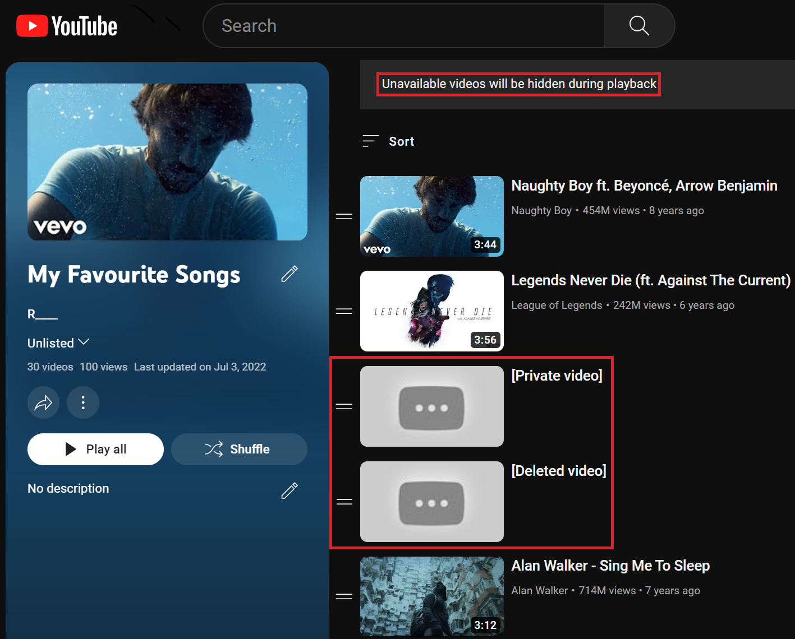

# Metadata Retrieval & Recovery Tool

### Missing Videos
When a video in a playlist on YouTube is deleted or set to private, all information other than its URL is lost. If the video was in your default Liked Playlist, not even the URL will remain.

### The API Tool

This is a tool I developed to recover videos in these scenarios. Using YouTube's API, it takes a snapshot of all the playlists on your YouTube account and saves this data locally. It will record each video's title, uploader, video status, playlist, and description. It will then compare the differences between a previous snapshot and find and indicate any lost videos. All information is recorded into different CSV files, which can be revisited anytime for further information. 

